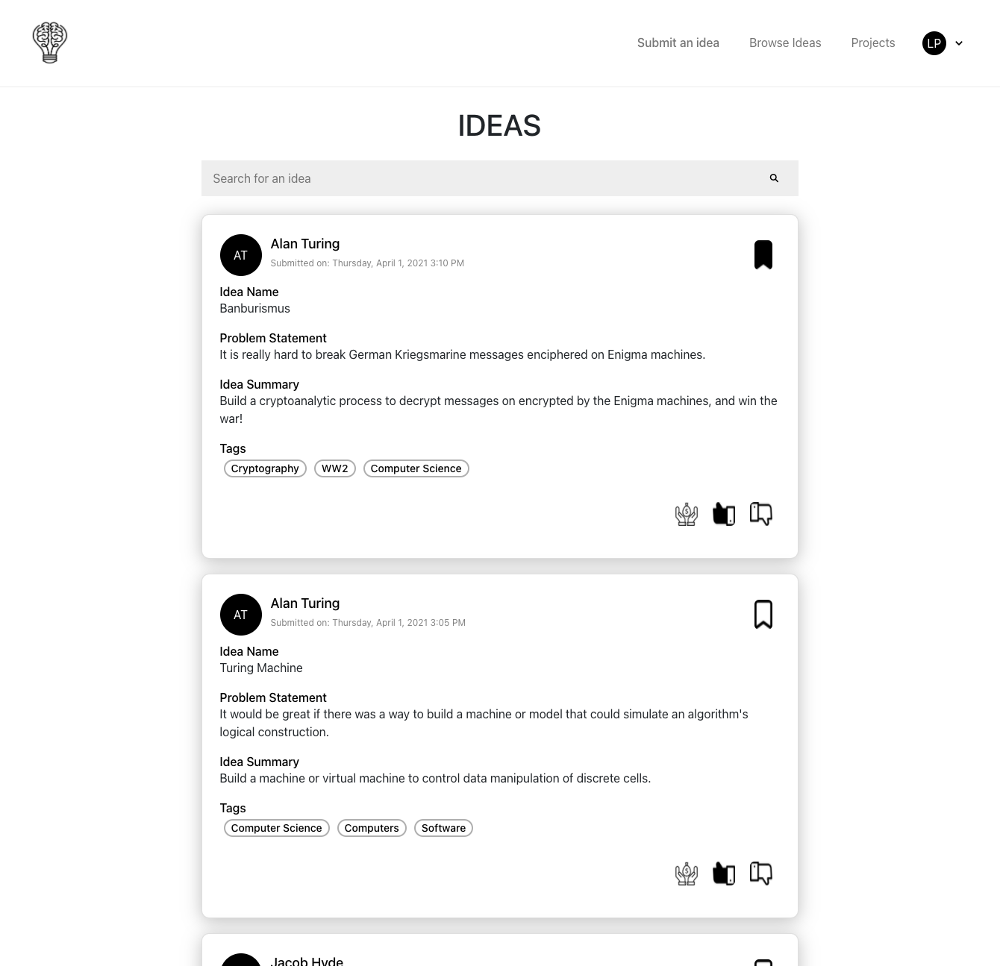

# Welcome to KickApp
KickApp is a two-sided marketplace where users can create app ideas and connect with developers. KickApp has many features, including a Reddit style feed of ideas where users can up and down vote ideas, the ability to sponsor ideas with Stripe payment integration, bookmark and save your favorite ideas, and more!

Signup and try out the app here: [KickApp](https://kicksterapp.herokuapp.com/)

# The Stack 
This application utilizes Ruby, Ruby on Rails, JavaScriptReact, Redux, Baseweb 

# Local Setup Guide
NOTE: If you do not have postgresql installed, please install it with homebrew https://www.postgresql.org/download/macosx/. Another resource to summarize this installation is here https://flaviocopes.com/postgres-how-to-install/.

1. Fork and clone this repo `git clone git@github.com:jakemeout/KickApp.git`
1. Navigate to the api folder and run `bundle install`
1. Run the following commands to create and migrate the Postgres database
```
rails db:create
rails db:migrate
rails s // To run the local server
```
1. Navigate to the frontend folder and run `npm install`
1. Run `npm start` to run the local server
1. Ensure to navigate to the Redux Actions file to change the fetch calls to the backend server and port you specified when running the rails server. 

# ScreenShots




Please follow up with any questions by emailing me at [Jhyde@me.com](mailto:jhyde@me.com)